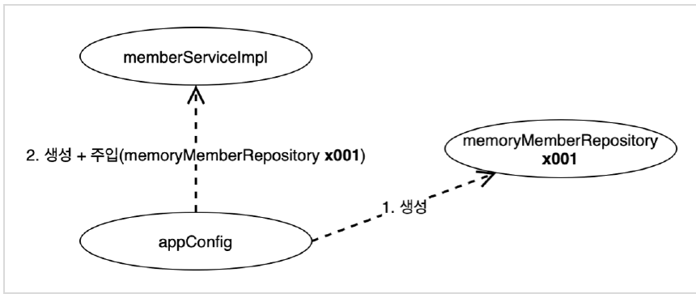

# 1. 객체 지향 원리 적용

순수한 자바 코드로 작성한 상태에서 새로운 할인 정책을 확장

---

# 새로운 할인 정책 개발

VIP 등급의 할인 정책 1000 --> 10% 할인

+ 객체지향 설계 원칙을 준수 해서 작성해놓았기 때문에 걱정 없음

discount/RateDiscountPolicy

```java
public class RateDiscountPolicy implements DiscountPolicy {

    private int discountPercent = 10;

    @Override
    public int discount(Member member, int price) {
        if (member.getGrade() == Grade.VIP) {
            return price * discountPercent / 100;
        } else {
            return 0;
        }
    }
}
```

할인정책을 추가하고 테스트

```java
class RateDiscountPolicyTest {

    RateDiscountPolicy discountPolicy = new RateDiscountPolicy();

    @Test
    @DisplayName("VIP는 10% 할인이 적용되어야 한다.")
    void vip_o() {
        //given
        Member member = new Member(1L, "memberVIP", Grade.VIP);
        //when
        int discount = discountPolicy.discount(member, 10000);
        //then
        assertThat(discount).isEqualTo(1000);
    }

    @Test
    @DisplayName("VIP가 아니면 할인이 적용되지 않아야 한다")
    void vip_x() {
        //given
        Member member = new Member(2L, "memberBASIC", Grade.BASIC);
        //when
        int discount = discountPolicy.discount(member, 10000);
        //then
        assertThat(discount).isEqualTo(0);
    }
}
```

---

## 새로운 할인 정책 적용과 문제점

할인 정책을 변경하려면 클라이언트인 `OrderServiceImpl`에서 할인정책을 변경해주어야 한다

```java
private final MemberRepository memberRepository=new MemoryMemberRepository();
//private final DiscountPolicy discountPolicy = new FixDiscountPolicy();
private final DiscountPolicy discountPolicy=new RateDiscountPolicy();
```

**문제점**

+ 역할과 구현을 분리했다. -> OK
+ 다형성 활용, 인터페이스와 구현 객체 분리 -> OK
+ OCP, DIP 같은 객체지향 설계 원칙을 충실히 준수했다.
    + 그렇게 보이지만 사실은 아니다.
+ DIP: 주문 서비스 클라이언트 (`OrderServiceImpl`)는 `DiscountPolicy` 인터페이스에 의존하면서 DIP를 지켰나?
    + 추상(인터페이스) 뿐만 아니라 **구체(구현) 클래스에도 의존**하고 있다.
+ OCP: 변경하지 않고 확장할 수 있다.
    + 기능을 확장해서 변경하면, **클라이언트 코드에 영향을 준다.**

**기대했던 의존관계**


클라이언트인 `OrderServiceImpl`이 `DiscountPolicy` 인터페이스에만 의존한다고 생각했지만 실제로는 `DiscountPolicy`뿐만 아니라 `FixDiscountPolicy`인 구체 클래스도
함께 의존하고 있다.

**실제 의존 관계**


-> **DIP위반**

**정책 변경**


`FixDiscountPolicy`를 `RateDiscountPolicy`로 변경하는 순간 `OrderServiceImpl`의 소스 코드도 함께 변경해야 한다.

-> **OCP 위반**

## 문제

+ 클라이언트 코드인 `OrderServiceImpl`은 `DiscountPolicy`의 인터페이스 뿐만 아니라 구체 클래스도 함께 의존
    + 구체 클래스를 변경할 때 클라이언트 코드도 함께 변경해야 한다.
    + **DIP 위반**
        + DIP를 위반하지 않도록 인터페이스만 의존하도록 의존관계 변경

`OrderServiceImpl`에서 인터페이스에만 의존하도록 코드를 변경

```java
  private DiscountPolicy discountPolicy;
```

인터페이스에만 의존하도록 코드를 변경했지만 NPE(null pointer exception)가 발생한다.

**해결방안**

클라이언트인 `OrderServiceImpl`에 `DiscountPolicy`의 구현 객체를 대신 생성하고 주입해주어야 한다.

---

# 관심사의 분리

+ 애플리케이션을 하나의 공연이라고 생각.
    + 각각의 인터페이스는 배역(배우)
+ 공연을 하면 역할을 누가 할지는 인터페이스(배우)가 정하는게 아니다.
    + `private DiscountPolicy discountPolicy = new FixDiscountPolicy();` (X)

+ 이전 코드는 배우가 배우를 직접 초빙하는 것 즉, 다양한 책임을 가지고 있다.

## 관심사를 분리하자

+ 배우는 본인의 배역을 수행하는 것에만 집중해야 한다.
+ 어떤 상대 배우가 선택되더라고 똑같이 공연을 할 수 있어야함.
+ **공연 기획자**가 필요하다.
+ 공연 기획자를 만들고, 배우와 공연 기획자의 책임을 확실히 분리해야 함

## AppConfig 등장

+ 애플리케이션의 전체 동작 방식을 구성(config)하기 위해, **구현 객체를 생성**, **연결**하는 책임을 가지는 별도의 설정 클래스

기존에는 객체를 생성하고 인터페이스에 할당하는것을 `MemberServiceImpl`에서 직접 했다.

`privtate final MemberRepository memberRepository = new MemoryMemberRepository();`

배우가 직접 배우를 선정하는 것.

생성자를 통해서 MemberRepository의 구현체에 들어갈 것을 정한다.

member/MemberServiceImpl

```java
public class MemberServiceImpl implements MemberService {

    private final MemberRepository memberRepository;

    public MemberServiceImpl(MemberRepository memberRepository) {
        this.memberRepository = memberRepository;
    }

    @Override
    public void join(Member member) {
        memberRepository.save(member);
    }

    @Override
    public Member findMember(Long memberId) {
        return memberRepository.findById(memberId);
    }
}
```

order/OrderServiceImpl

```java
public class OrderServiceImpl implements OrderService {

    private final MemberRepository memberRepository;
    private final DiscountPolicy discountPolicy;

    public OrderServiceImpl(MemberRepository memberRepository, DiscountPolicy discountPolicy) {
        this.memberRepository = memberRepository;
        this.discountPolicy = discountPolicy;
    }

    @Override
    public Order createOrder(Long memberId, String itemName, int itemPrice) {
        Member member = memberRepository.findById(memberId);
        int discountPrice = discountPolicy.discount(member, itemPrice);

        return new Order(memberId, itemName, itemPrice, discountPrice);
    }
}

```

AppConfig를 통해 MemberService를 불러다 쓰는 구조
**생성자 주입**

```java
public class AppConfig {
    public MemberService memberService() {
        return new MemberServiceImpl(new MemoryMemberRepository());
    }

    public OrderService orderService() {
        return new OrderServiceImpl(
                new MemoryMemberRepository(),
                new FixDiscountPolicy());
    }
}
```

`MemberServiceImpl`와 `OrderServiceImpl`엔 `MemoryMemberRepository`에 대한 코드가 없어졌다!

AppConfig는 애플리케이션의 실제 동작에 필요한 **구현 객체를 생성**한다.
+ `MemberServiceImpl`
+ `MemoryMemberRepository`
+ `OrderServiceImpl`
+ `FixDiscountPolicy`

AppConfig는 생성한 객체 인스턴스의 참조(레퍼런스)를 **생성자를 통해서 주입(연결)** 해준다.
+ `MemberServiceImpl` -> `MemoryMemberRepository`
+ `OrderServiceImpl` -> `MemoryMemberRepository`,`FixDiscountPolicy`

### `MemberServiceImpl`은 의존관계에 대한 고민은 외부에 맡기고 실행에만 집중한다.


+ 객체의 생성과 연결은 `AppConfig`가 담당
+ **DIP 완성**: `MemberServiceImpl`은 `MemberRepository`인 추상에만 의존.
  + 구체 클래스를 몰라도 된다.
+ 관심사의 분리: 객체를 생성하고 연결하는 역할과 실행하는 역할이 명확히 분리됨.



+ `appConfig` 객체는 `MemoryMemberRepository` 객체를 생헝하고 그 참조값을 `memberServiceImpl`을 생성하면서 생성자로 전달
+ 클라이언트인 `memberServiceImpl`입장에서 의존관계를 외부에서 주입해주는 것 같기 때문에 DI(Dependency Injection)이라 한다.
+ `OrderServiceImpl`도 마찬가지

AppConfig 실행

MemberApp

```java
public class MemberApp {
    public static void main(String[] args) {
        AppConfig appConfig = new AppConfig();
        MemberService memberService = appConfig.memberService();

        //MemberService memberService = new MemberServiceImpl();
        Member member = new Member(1L, "memberA", Grade.VIP);
        memberService.join(member);

        Member findMember = memberService.findMember(1L);
        System.out.println("new member = " + member.getName());
        System.out.println("find member = " + findMember.getName());

    }
}
```

OrderApp

```java
public class OrderApp {

    public static void main(String[] args) {

        AppConfig appConfig = new AppConfig();
        MemberService memberService = appConfig.memberService();
        OrderService orderService = appConfig.orderService();

        //MemberService memberService = new MemberServiceImpl(null);
        //OrderService orderService = new OrderServiceImpl(null,null);

        Long memberId = 1L;
        Member member = new Member(memberId,"memberA", Grade.VIP);
        memberService.join(member);

        Order order = orderService.createOrder(memberId, "itemA", 10000);
        System.out.println("order = " + order);
        System.out.println("order.calculatePrice() = " + order.calculatePrice());
    }
}
```

## 정리
+ AppConfig를 통해서 관심사 분리
+ AppConfig는 구체 클래스를 선택. 
+ 각 배우들은 담당 기능을 실행하는 책임만 진다.
  + `OrderServiceImpl`은 기능을 실행하는 책임만 지면 된다.

---

# AppConfig 리팩터링


지금의 AppConfig는 중복이 있고 **역할**에 따른 **구현** 이 잘 보이지 않는다.

**리팩터링 전**

```java
public class AppConfig {
    public MemberService memberService(){
        return new MemberServiceImpl(new MemoryMemberRepository());
    }

    public OrderService orderService(){
        return new OrderServiceImpl(
                new MemoryMemberRepository(),
                new FixDiscountPolicy());
    }
}
```

중복을 제거하고 역할에 따른 구현이 잘 보이도록 리팩터링

**리팩터링 후**

```java
public class AppConfig {
    public MemberService memberService(){
        return new MemberServiceImpl(memberRepository());
    }

    private MemoryMemberRepository memberRepository() {
        return new MemoryMemberRepository();
    }

    public OrderService orderService(){
        return new OrderServiceImpl(
                memberRepository(),
                discountPolicy());
    }
    
    public DiscountPolicy discountPolicy(){
        return new FixDiscountPolicy();
    }
}
```

+ `new MemoryMemberRepository()` 중복 제거
+ `MemoryMemberRepository`를 다른 구현체로 변경하게 되면 한 부분만 변경하면 된다.
+ `AppConfig`를 보면 역할과 구현 클래스가 한눈에 들어온다.

---

# 새로운 구조와 할인 정책 적용

정액 할인 정책을 정률% 할인 정책으로 변경
`FixDiscountPolicy` -> `RateDiscountPolicy`


AppConfig만 변경하면 된다!


```java
public class AppConfig {
    //...
  
    public DiscountPolicy discountPolicy(){
        //return new FixDiscountPolicy();
        return new RateDiscountPolicy();
    }
}

```

+ 할인 정책을 변경해도, 애플리케이션의 구성 역할을 담당하는 `AppConfig`만 변경하면 된다.

# 좋은 객체 지향 설계의 5가지 원칙의 적용

여기서는 SRP, DIP, OCP 적용

---

**SRP 단일 책임 원칙**

한 클래스는 하나의 책임만 가져야 한다.
+ 구현 객체를 생성하고 연결하는 책임은 AppConfig
+ 클라이언트 객체는 실행하는 책임만 담당

**DIP 의존관계 역전 원칙**

프로그래머는 추상화에 의존해야지, 구체화에 의존하면 안된다.
+ AppConfig가 `FixDiscountPolicy` 객체 인스턴스를 클라이언트 코드 대신 생성해서 클라이언트 코드에 의존관계 주입

**OCP 개방 폐쇄 원칙**

소프트웨어 요소는 확장에는 열려 있으나 변경에는 닫혀 있어야 한다.
+ 다형성 사용하고 클라이언트가 DIP를 지킴
+ 애플리케이션을 사용역역과 구성영역으로 나눔
+ AppConfig가 의존관계를 FixDiscountPolicy > RateDiscountPolicy로 변경해서 클라이언트에 주입하므로 클라이언트는 코드를 변경하지 않아도 됨
+ **소프트웨어 요소를 새롭게 확장해도 사용 영역의 변경은 닫혀있다.**

---

# IoC, DI, 컨테이너

**제어의 역전 IoC(Inversion of Control)**

+ 기존 프로그램은 구현 객체가 스스로 필요한 서버 구현 객체를 생성, 연결, 실행
+ AppConfig가 등장하면서 구현 객체는 자신의 로직을 실행하는 역할만 담당.
+ 프로그램의 제어 흐름은 AppConfig가 가져간다.
+ 프로그램의 제어 흐름을 직접 제어하는 것이 아니라 외부에서 관리하는 것이 제어의 역전(IoC)


**프레임워크 Vs 라이브러리**

+ 프레임워크: 프레임워크가 내가 작성한 코드를 제어하고, 대신 실행하는것 ex) JUnit
+ 라이브러리: 내가 작성한 코드가 직접 제어의 흐름을 담당

**의존관계 주입 DI(Dependency Injection)**

+ `OrderServiceImpl`은 `DiscountPolicy` 인터페이스에 의존.
+ 의존 관계는 **정적인 클래스 의존 관계**와, 실행 시점에 결정되는 **동적인 객체(인스턴스) 의존 관계** 둘을 분리해서 생각해야 한다.

**정적인 클래스 의존관계**

+ 클래스가 사용하는 import 코드만 보고 의존관계를 쉽게 판단 가능.
+ 애플리케이션을 실행하지 않아도 분석할 수 있다.
+ `OrderServiceImpl`은 `MemberRepository`,`DiscountPolicy`에 의존한다는 것을 알 수 있지만 실제 어떤 객체가 주입될지 알 수 없다.

**동적인 객체 인스턴스 의존 관계**

+ 애플리케이션 **실행시점(런타임)** 에 외부에서 실제 구현 객체를 생성하고 클라이언트에 전달해서 클라이언트와 서버의 실제 의존관계가 연결 되는것을 **의존관계 주입** 이라고 한다.
+ 객체 인스턴스를 생성하고, 그 참조값을 전달해서 연결
+ 의존관계 주입을 사용하면 클라이언트 코드를 변경하지 않고, 클라이언트가 호출하는 대상의 타입 인스턴스를 변경할 수 있다.
+ 의존관계 주입을 사용하면 정적인 클래스 의존관계를 변경하지 않고, 동적인 객체 인스턴스 의존관계를 쉽게 변경할 수 있다.


**IoC컨테이너, DI 컨테이너**
+ AppConfig 처럼 객체를 생성하고 관리하면서 의존관계를 연결해 주는 것
+ 의존관계 주입에 초점을 맞추어 최근에는 주로 `DI 컨테이너`라고 한다.

---

# 스프링으로 전환하기

AppConfig 스프링 기반으로 변경

```java
@Configuration
public class AppConfig {

    @Bean
    public MemberService memberService(){
        return new MemberServiceImpl(memberRepository());
    }

    @Bean
    public MemoryMemberRepository memberRepository() {
        return new MemoryMemberRepository();
    }

    @Bean
    public OrderService orderService(){
        return new OrderServiceImpl(
                memberRepository(),
                discountPolicy());
    }
    @Bean
    public DiscountPolicy discountPolicy(){
        //return new FixDiscountPolicy();
        return new RateDiscountPolicy();
    }
}
```

`@Configuration` AppConfig에 설정을 구성한다는 뜻

`@Bean` 을 붙여주면 스프링 컨테이너에 스프링 빈으로 등록한다.

MemberApp에 스프링 컨테이너 적용

```java

public class MemberApp {
    public static void main(String[] args) {
        ApplicationContext applicationContext = new AnnotationConfigApplicationContext(AppConfig.class);

        MemberService memberService = applicationContext.getBean("memberService", MemberService.class);


        Member member = new Member(1L, "memberA", Grade.VIP);
        memberService.join(member);

        Member findMember = memberService.findMember(1L);
        System.out.println("new member = " + member.getName());
        System.out.println("find member = " + findMember.getName());
    }
}

```

OrderApp에 스프링 컨테이너 적용

```java
public class OrderApp {
    public static void main(String[] args) {

        ApplicationContext applicationContext = new AnnotationConfigApplicationContext(AppConfig.class);
        MemberService memberService = applicationContext.getBean("memberService", MemberService.class);
        OrderService orderService = applicationContext.getBean("orderService", OrderService.class);

        Long memberId = 1L;
        Member member = new Member(memberId,"memberA", Grade.VIP);
        memberService.join(member);

        Order order = orderService.createOrder(memberId, "itemA", 10000);
        System.out.println("order = " + order);
        System.out.println("order.calculatePrice() = " + order.calculatePrice());
    }
}
```

**스프링 컨테이너**
+ `ApplicationContext` 를 스프링 컨테이너라 한다.
+ 기존에는 AppConfig를 사용해 직접 DI를 했지만, 스프링 컨테이너를 통해서 사용할 수 있게됨
+ 스프링 컨테이너는 `@Configuration`이 붙은 `AppConfig`를 설정 정보로 사용.
  + `@Bean`이라 적힌 메서드를 모두 호출해서 반환된 객체를 스프링 컨테이너에 등록
  + 스프링 컨테이너에 등록된 객체를 `스프링 빈`이라 한다.
+ 스프링 빈은 `applicationContext.getBean()` 메서드를 사용해서 찾을 수 있다.
  + `applicationContext.getBean("memberService",MemberService.class);`
  