# 2. 스프링 컨테이너와 스프링 빈

---

## 스프링 컨테이너 생성

스프링 컨테이너가 생성되는 과정

```java
//스프링 컨테이너 생성
ApplicationContext applicationContext=new AnnotationConfigApplicationContext(AppConfig.class);
```

+ `ApplicationContext`: 스프링 컨테이너
+ `ApplicationContext`: 인터페이스
+ 스프링 컨테이너는 XML을 기반으로 만들수 있고, 애노테이션 기반의 자바 설정 클래스로 만들 수 있다.
+ 자바 설정클래스를 기반으로 스프링 컨테이너(`ApplicationContext`)를 만들면
    + `new AnnotationConfigApplicationContext(AppConfig.class);`
    + 위 클래스는 `ApplicationContext` 인터페이스의 구현체이다.

> 참고: 스프링 컨테이너를 부를 때 `BeanFactory`,`ApplicationContext`로 구분해서 이야기 하지만 `BeanFactory`를 직접 사용하는 경우는 거의 없으므로 일반적으로 `ApplicationContext`를 스프링 컨테이너라 한다.

스프링 컨테이너의 생성과정

### 1.스프링 컨테이너 생성

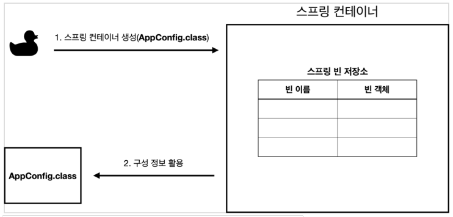

+ `new AnnotationConfigApplicationContext(AppConfig.class);`
+ 스프링 컨테이너를 생성할 때는 구성정보를 지정해주어야 한다.
+ `AppConfig.class` 가 구성 정보

### 2. 스프링 빈 등록

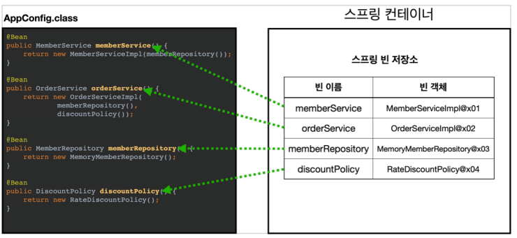

+ 스프링 컨테이너는 파라미터로 넘어온 설정 클래스 정보를 사용해 스프링 빈을 등록한다.

**빈 이름**

+ 빈 이름은 메서드 이름을 사용한다.
+ 빈 이름을 직접 부여해도 된다.
    + `@Bean(name="memberService2")`

> 주의: 빈 이름은 **항상 다른 이름을 부여**해야 한다. 같은 이름이 부여되면 다른 빈이 무시되거나 기존 빈을 덮어버리는 등 오류가 발생한다.

### 3. 스프링 빈 의존관계 설정 - 준비

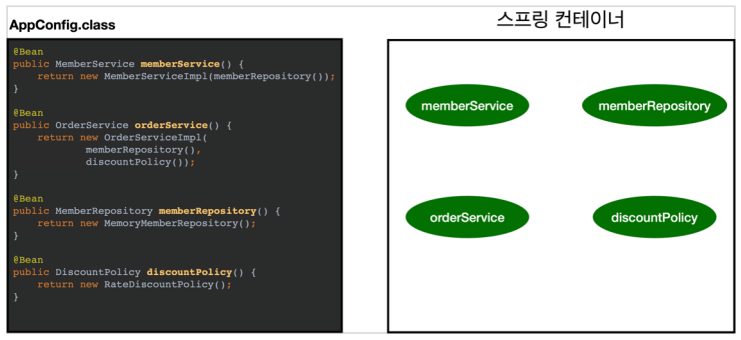

### 4. 스프링 빈 의존관계 설정 - 완료

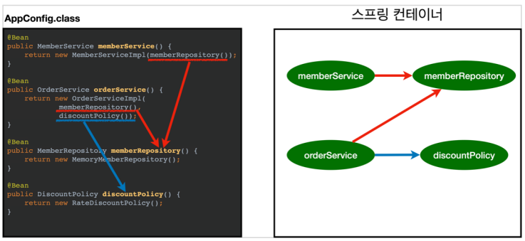

+ 스프링 컨테이너는 설정 정보를 참고해서 의존관계를 주입(DI) 한다.

**참고**

스프링 빈을 생성하고, 의존관계를 주입하는 단계가 나누어져 있다. 그런데 자바 코드로 스프링 빈을 등록하면 생성자를 호출하면서 의존관계 주입도 한번에 처리된다.

---

## 컨테이너에 등록된 모든 빈 조회

```java
public class ApplicationContextInfoTest {

    AnnotationConfigApplicationContext ac = new AnnotationConfigApplicationContext(AppConfig.class);

    @Test
    @DisplayName("모든 빈 출력하기")
    void findAllBean() {
        String[] beanDefinitionNames = ac.getBeanDefinitionNames(); //빈 이름
        for (String beanDefinitionName : beanDefinitionNames) {
            Object bean = ac.getBean(beanDefinitionName); //빈 객체
            System.out.println("name=" + beanDefinitionName + " object=" + bean);
        }
    }


    @Test
    @DisplayName("애플리케이션 빈 출력하기")
    void findApplicationBean() {
        String[] beanDefinitionNames = ac.getBeanDefinitionNames();
        for (String beanDefinitionName : beanDefinitionNames) {
            BeanDefinition beanDefinition = ac.getBeanDefinition(beanDefinitionName);

            //Role ROLE_APPLICATION: 직접 등록한 애플리케이션 빈
            //Role ROLE_INFRASTRUCTURE: 스프링이 내부에서 사용하는 빈
            if (beanDefinition.getRole() == BeanDefinition.ROLE_APPLICATION) {
                Object bean = ac.getBean(beanDefinitionName);
                System.out.println("name=" + beanDefinitionName + " object=" + bean);
            }
        }
    }
}
```

+ 모든 빈 출력하기
    + `ac.getBeanDefinitionNames()` 스프링에 등록된 모든 빈 이름을 조회
    + `ac.getBean()` 빈 이름으로 빈 객체(인스턴스)를 조회

+ 애플리케이션 빈 출력하기
    + 스프링이 내부에서 사용하는 빈은 제외하고 직접 등록한 빈 출력
    + 스프링이 내부에서 사용하는 빈은 getRole()로 구분
        + `ROLE_APPLICATION` 직접 정의한 빈
        + `ROLE_INFRASTRUCTURE` 스프링이 내부에서 사용하는 빈

---

## 스프링 빈 조회 - 기본

스프링 컨테이너에서 스프링 빈을 찾는 가장 기본적인 조회 방법
+ `ac.getBean(빈이름,타입)`
+ `ac.getBean(타입)`
+ 조회 대상 스프링 빈이 없으면 예외 발생

```java
public class ApplicationContextBasicFindTest {

    AnnotationConfigApplicationContext ac = new AnnotationConfigApplicationContext(AppConfig.class);

    @Test
    @DisplayName("빈 이름으로 조회")
    void findBeanByName(){
        MemberService memberService = ac.getBean("memberService", MemberService.class);
        assertThat(memberService).isInstanceOf(MemberServiceImpl.class);
    }

    @Test
    @DisplayName("이름 없이 타입으로만 조회")
    void findBeanByType(){
        MemberService memberService = ac.getBean(MemberService.class);
        assertThat(memberService).isInstanceOf(MemberServiceImpl.class);
    }

    @Test
    @DisplayName("구체 타입으로 조회")
    void findBeanByName2(){
        MemberService memberService = ac.getBean("memberService", MemberServiceImpl.class);
        assertThat(memberService).isInstanceOf(MemberServiceImpl.class);
    }

    @Test
    @DisplayName("빈 이름으로 조회X")
    void findByBeanNameX(){
        //ac.getBean("xxxxx",MemberService.class);
        //MemberService xxxxx = ac.getBean("xxxxx", MemberService.class);
        assertThrows(NoSuchBeanDefinitionException.class,
                () -> ac.getBean("xxxxx",MemberService.class));
    }
}
```

+ 구체 타입으로 조회하면 변경시 유연성이 떨어져서 권장되지 않는다.


## 스프링 빈 조회 - 동일한 타입이 둘 이상일 경우

+ 타입으로 조회시 같은 타입의 스프링 빈이 둘 이상이면 오류가 발생한다.
  + 이때는 빈 이름을 지정하자
+ `ac.getBeansOfType()`을 사용하면 해당 타입의 모든 빈을 조회할 수 있다.

```java
public class ApplicationContextSameBeanFindTest {

    AnnotationConfigApplicationContext ac = new AnnotationConfigApplicationContext(SameBeanConfig.class);
    
    @Test
    @DisplayName("타입으로 조회시 같은 타입이 둘 이상 있으면, 중복 오류가 발생한다")
    void findBeanByTypeDuplicate(){
        assertThrows(NoUniqueBeanDefinitionException.class,
                () -> ac.getBean(MemberRepository.class));
    }

    @Test
    @DisplayName("타입으로 조회시 같은 타입이 둘 이상 있으면, 빈 이름을 지정하면 된다")
    void findByName(){
        MemberRepository memberRepository = ac.getBean("memberRepository1", MemberRepository.class);
        assertThat(memberRepository).isInstanceOf(MemberRepository.class);
    }

    @Test
    @DisplayName("특정 타입을 모두 조회하기")
    void findAllBeanByType(){
        Map<String, MemberRepository> beansOfType = ac.getBeansOfType(MemberRepository.class);
        for (String key : beansOfType.keySet()) {
            System.out.println("key= " + key + " value = " + beansOfType.get(key));
        }

        System.out.println("beansOfType = " + beansOfType);
        assertThat(beansOfType.size()).isEqualTo(2);
    }

    @Configuration
    static class SameBeanConfig {

        @Bean
        public MemberRepository memberRepository1() {
            return new MemoryMemberRepository();
        }

        @Bean
        public MemberRepository memberRepository2() {
            return new MemoryMemberRepository();
        }
    }
}
```

+ 타입으로 조회시 같은 타입이 둘 이상있으면 에러 발생
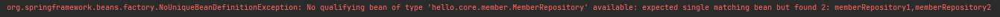

    + 빈 이름을 지정하면 해결 할 수 있다.


## 스프링 빈 조회 - 상속 관계

+ 부모 타입으로 조회하면 자식 타입도 함께 조회한다.
+ 모든 자바 객체의 최고 부모인 `Object` 타입으로 조회하면 모든 스프링 빈을 조회한다.

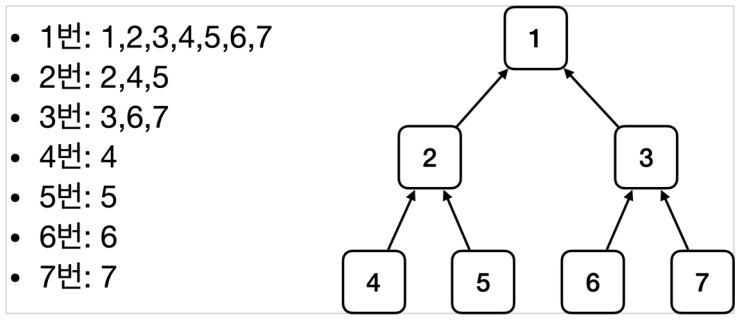


```java
public class ApplicationContextExtendsFindTest {

    AnnotationConfigApplicationContext ac = new AnnotationConfigApplicationContext(TestConfig.class);

    @Test
    @DisplayName("부모 타입으로 조회시 자식이 둘 이상 있으면 중복 오류가 발생한다")
    void findBeanByParentTypeDuplicate(){
        assertThrows(NoUniqueBeanDefinitionException.class,
                () -> ac.getBean(DiscountPolicy.class));
    }

    @Test
    @DisplayName("부모 타입으로 조회시 자식이 둘 이상 있으면 빈 이름을 지정하면 된다")
    void findBeanByParentTypeBeanName(){
        DiscountPolicy rateDiscountPolicy = ac.getBean("rateDiscountPolicy", DiscountPolicy.class);
        assertThat(rateDiscountPolicy).isInstanceOf(RateDiscountPolicy.class);
    }

    @Test
    @DisplayName("특정 하위 타입으로 조회") //좋지 않은 방법
    void findByBeanBySubType(){
        RateDiscountPolicy bean = ac.getBean(RateDiscountPolicy.class);
        assertThat(bean).isInstanceOf(RateDiscountPolicy.class);
    }

    @Test
    @DisplayName("부모 타입으로 모두 조회하기")
    void findAllBeanByParentType(){
        Map<String, DiscountPolicy> beansOfType = ac.getBeansOfType(DiscountPolicy.class);
        assertThat(beansOfType.size()).isEqualTo(2);
        for (String key : beansOfType.keySet()) {
            System.out.println("key = " + key + " value = " + beansOfType.get(key));
        }
    }

    @Test
    @DisplayName("부모 타입으로 모두 조회하기 - Object")
    void findAllBeanByObjectType(){
        Map<String, Object> beansOfType = ac.getBeansOfType(Object.class);
        for (String key : beansOfType.keySet()) {
            System.out.println("key = " + key + " value = " + beansOfType.get(key));
        }
    }

    @Configuration
    static class TestConfig{
        @Bean
        public DiscountPolicy rateDiscountPolicy(){
            return new RateDiscountPolicy();
        }

        @Bean
        public DiscountPolicy fixDiscountPolicy(){
            return new FixDiscountPolicy();
        }
    }
}
```

---

## BeanFactory와 ApplicationContext

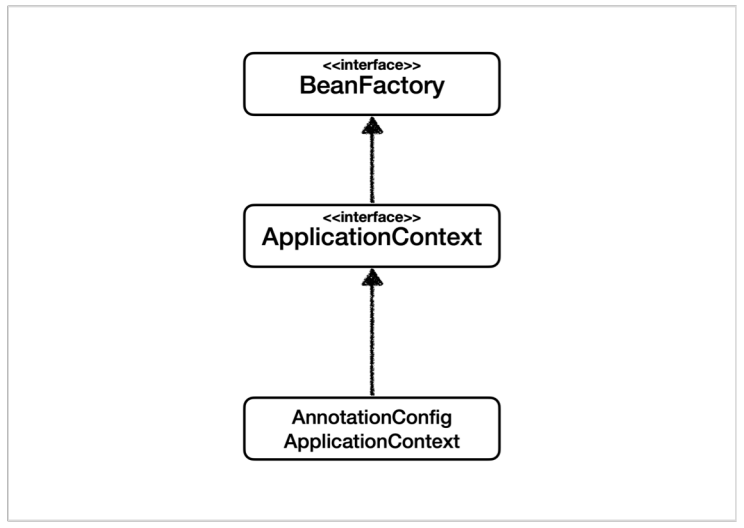

### BeanFactory

+ 스프링 컨테이너의 최상위 인터페이스
+ 스프링 빈을 관리하고 조회하는 역할을 담당
+ 지금까지 사용한 대부분의 기능은 BeanFactory가 제공하는 기능

### ApplicationContext

+ BeanFactory 기능을 모두 상속받아서 제공
+ 많은 부가 기능이 존재한다.

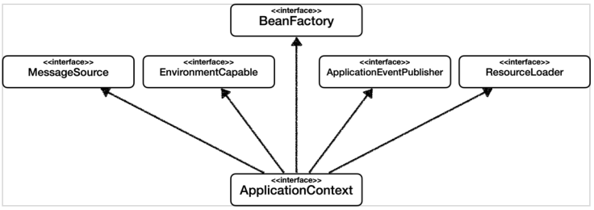

+ 메시지소스를 활용한 국제화 기능
  + 한국에서 들어오면 한국어로, 영어권에서 들어오면 영어로 출력
+ 환경변수
  + 로컬, 개발, 운영등을 구분해서 처리
+ 애플리케이션 이벤트
  + 이벤트를 발행하고 구독하는 모델을 편리하게 지원
+ 편리한 리소스 조회
  + 파일, 클래스패스, 외부 등에서 리소스를 편리하게 조회

### 정리

+ ApplicationContext는 BeanFactory의 기능을 상속받는다.
+ ApplicationContext는 빈 관리기능 + 부가 기능을 제공
+ BeanFactory를 직접 사용하는 일은 거의 없다. 부가 기능이 포함된 ApplicationContext를 사용
+ BeanFactory나 ApplicationContext를 **스프링 컨테이너**라 한다.

---

## 다양한 설정 형식 지원 - 자바코드, XML

스프링 컨테이너는 다양한 형식의 설정 정보를 받아드릴 수 있게 설계되어 있다.

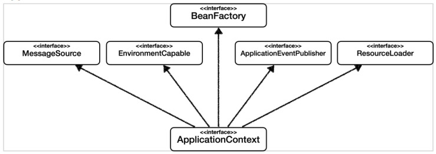

XML 설정 사용
+ 최근에는 XML 기반의 설정은 잘 사용하지 않는다.
+ `GenericXmlApplicationContext`를 사용하면서 xml 설정 파일을 넘기면 된다.

appConfig.xml
```xml
<?xml version="1.0" encoding="UTF-8"?>
<beans xmlns="http://www.springframework.org/schema/beans"
       xmlns:xsi="http://www.w3.org/2001/XMLSchema-instance"
       xsi:schemaLocation="http://www.springframework.org/schema/beans http://www.springframework.org/schema/beans/spring-beans.xsd">

    <bean id = "memberService" class = "hello.core.member.MemberServiceImpl">
        <constructor-arg name="memberRepository" ref="memberRepository"/>

    </bean>

    <bean id="memberRepository" class="hello.core.member.MemoryMemberRepository"/>


    <bean id = "orderService" class="hello.core.order.OrderServiceImpl">
        <constructor-arg name="memberRepository" ref="memberRepository" />
        <constructor-arg name="discountPolicy" ref="discountPolicy"/>
    </bean>

    <bean id ="discountPolicy" class="hello.core.discount.RateDiscountPolicy"/>
</beans>
```

```java
public class XmlAppContext {

    @Test
    void xmlAppContext(){
        ApplicationContext ac = new GenericXmlApplicationContext("appConfig.xml");
        MemberService memberService = ac.getBean("memberService", MemberService.class);
        assertThat(memberService).isInstanceOf(MemberService.class);
    }
}

```

`AppConfig.java`와 거의 비슷함

---

## 스프링 빈 설정 메타 정보 - BeanDefinition

+ 스프링이 다양한 설정 형식을 지원할 수 있는 이유: `BeanDefinition`이라는 추상화가 있다.
+ 역할과 구현을 개념적으로 나눈 것
  + XML을 읽어서 BeanDefinition을 만들면 된다.
  + 자바 코드를 읽어서 BeanDefnition을 만들면 된다.
  + 스프링 컨테이너는 오직 BeanDefinition만 알면 된다.

+ BeanDefinition을 빈 설정 메타정보라 한다.
  + @Bean, <bean> 각각 하나씩 메타 정보가 생성된다.

+ 스프링 컨테이너는 메타정보를 기반으로 스프링 빈을 생성

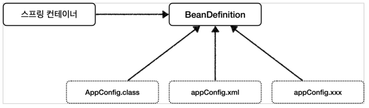

+ BeanDefinition 자체가 인터페이스.

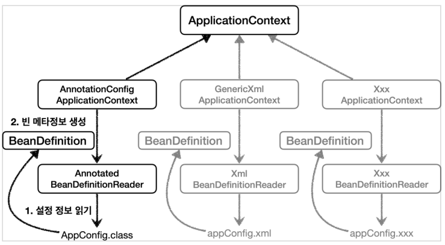

+ `AnnotationConfigApplicationContext`는 `AnnotatedBeanDefinitionReader`를 사용해서 AppConfig.class를 읽고 BeanDefinition을 생성한다.

### BeanDefinition 정보

+ BeanClassName: 생성할 빈의 클래스 명(자바 설정 처럼 팩토리 역할의 빈을 사용하면 없음)
+ factoryBeanName: 팩토리 역할의 빈을 사용할 경우 이름, 예) appConfig
+ factoryMethodName: 빈을 생성할 팩토리 메서드 지정, 예) memberService
+ Scope: 싱글톤(기본값)
+ lazyInit: 스프링 컨테이너를 생성할 때 빈을 생성하는 것이 아니라, 실제 빈을 사용할 때 까지 최대한
+ 생성을 지연처리 하는지 여부
+ InitMethodName: 빈을 생성하고, 의존관계를 적용한 뒤에 호출되는 초기화 메서드 명
+ DestroyMethodName: 빈의 생명주기가 끝나서 제거하기 직전에 호출되는 메서드 명
+ Constructor arguments, Properties: 의존관계 주입에서 사용한다. (자바 설정 처럼 팩토리 역할의 빈을 사용하면 없음)


```java
public class BeanDefinitionTest {

    AnnotationConfigApplicationContext ac = new AnnotationConfigApplicationContext(AppConfig.class);
    
    @Test
    @DisplayName("빈 설정 메타정보 확인")
    void findApplicationBean(){
        String[] beanDefinitionNames = ac.getBeanDefinitionNames();
        for (String beanDefinitionName : beanDefinitionNames) {
            BeanDefinition beanDefinition = ac.getBeanDefinition(beanDefinitionName);

            if(beanDefinition.getRole() == BeanDefinition.ROLE_APPLICATION){
                System.out.println("beanDefinitionName = " + beanDefinitionName + " beanDefinition = " + beanDefinition);
            }
        }
    }
}
```

+ BeanDefinition을 직접 생성해서 스프링 컨테이너에 등록할 수도 있지만 실무에선 사용할 일은 거의 없다.


