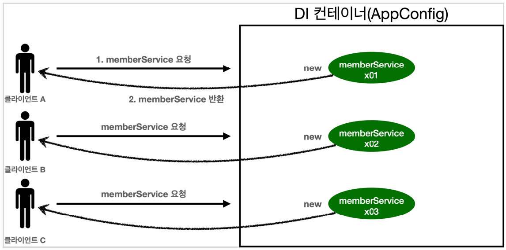
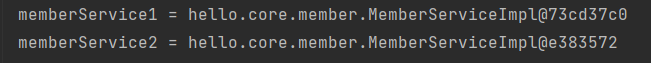
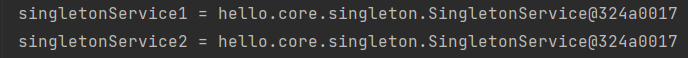
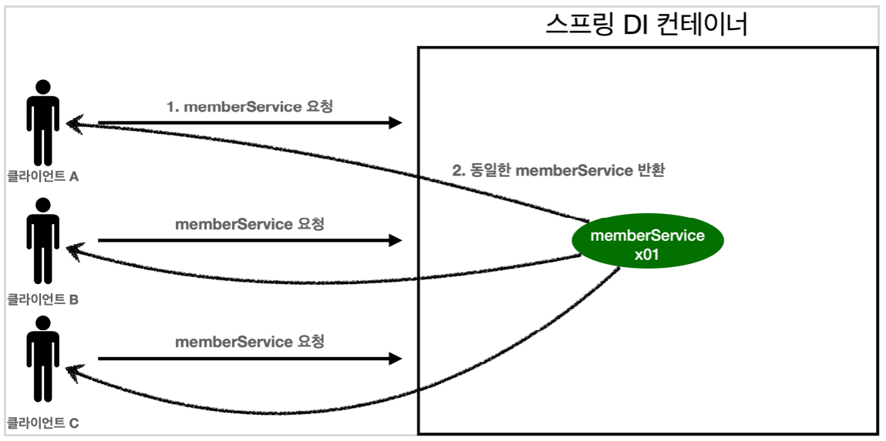
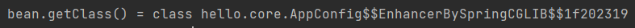
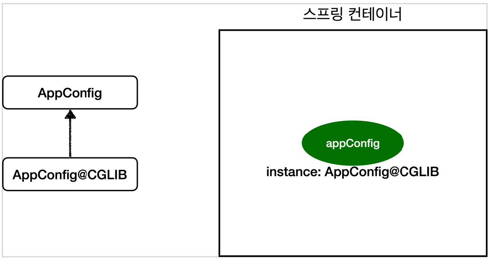

# 3. 싱글톤 컨테이너

---

## 웹 애플리케이션과 싱글톤

+ 대부분의 스프링 애플리케이션은 웹 애플리케이션이다.
+ 웹 애플리케이션은 보통 여러 고객이 동시에 요청한다.

---



```java
public class SingletonTest {

  @Test
  @DisplayName("스프링 없는 순수한 DI 컨테이너")
  void pureContainer(){
    AppConfig appConfig = new AppConfig();

    //1. 조회: 호출할 때 마다 객체를 생성
    MemberService memberService1 = appConfig.memberService();

    //2. 조회: 호출할 때 마다 객체를 생성
    MemberService memberService2 = appConfig.memberService();

    //참조값이 다른 것을 확인
    System.out.println("memberService1 = " + memberService1);
    System.out.println("memberService2 = " + memberService2);

    //memberService1 != memberService2
    Assertions.assertThat(memberService1).isNotSameAs(memberService2);
  }
}
```

**결과**




+ 순수하게 만들었던 `AppConfig`는 요청이 올때마다 객체를 새로 생성한다.
+ 메모리 낭비가 심함
  + 해당 객체가 1개만 생성되고 공유하게 설계해야 한다. -> 싱글톤 패턴

---

## 싱글톤 패턴

+ 클래스의 인스턴스가 딱 1개만 생성되는 것을 보장하는 디자인 패턴
+ 객체 인스턴스를 2개 이상 생성하지 못하도록 막아야 함
  + private 생성자를 사용해서 외부에서 임의로 new 키워드를 사용하지 못하게 해야함

```java
public class SingletonService {

    //1. static 영역에 객체를 딱 1개만 생성해둔다.
    private static final SingletonService instance = new SingletonService();

    //2. public으로 열어서 객체 인스턴스가 필요하면 이 static 메서드를 통해서만 조회하도록 허용한다.
    public static SingletonService getInstance(){
        return instance;
    }

    //3. 생성자를 private으로 선언해서 외부에서 new 키워드를 사용한 객체 생성을 못하게 막는다.
    private SingletonService(){
    }

    public void logic(){
        System.out.println("싱글톤 객체 로직 호출");
    }
}
```
1. static 영역에 객체 instacne를 미리 하나 생성한다
2. 오직 `getInstance()` 메서드를 통해서만 조회할 수 있다. 항상 같은 인스턴스 반환
3. pirvate으로 막아서 외부에서 new 키워드로 생성하는 것을 막는다.

```java
    @Test
    @DisplayName("싱글톤 패턴을 적용한 객체 사용")
    void singletonServiceTest(){

        SingletonService singletonService1 = SingletonService.getInstance();
        SingletonService singletonService2 = SingletonService.getInstance();

        System.out.println("singletonService1 = " + singletonService1);
        System.out.println("singletonService2 = " + singletonService2);

        assertThat(singletonService1).isSameAs(singletonService2);
    }
```

**결과**




+ 싱글톤 패턴을 적용하면 만들어진 객체를 공유해서 효율적으로 사용할 수 있다.

### 싱글톤 패턴 문제점

+ 구현하는 코드 자체가 많이 들어간다.
+ 의존관계상 클라이언트가 구체 클래스에 의존한다. -> DIP 위반
+ 클라이언트가 구체 클래스에 의존해서 OCP 원칙을 위반할 가능성이 높다.
+ 테스트가 어렵다.
+ 내부 속성을 변경하거나 초기화 하기 어렵다.
+ private 생성자로 자식 클래스를 만들기 어렵다.
+ 유연성이 떨어진다.
+ 안티패턴으로 불린다.

---

## 싱글톤 컨테이너

스프링 컨테이너는 싱글톤 패턴의 문제점을 해결하면서, 객체 인스턴스를 싱글톤으로 관리한다.

---

**싱글톤 컨테이너**

+ 스프링 컨테이너는 싱글톤 패턴을 적용하지 않아도, 인스턴스를 싱글톤으로 관리한다.
+ 스프링 컨테이너는 싱글톤 컨테이너 역할을 한다. -> 싱글톤 객체를 생성하고 관리하능 기능: 싱글톤 레지스트리 
+ 싱글톤 패턴의 모든 단점을 해결하면서 객체를 싱글톤으로 유지할 수 있다.
  + 지저분한 코드 X
  + DIP, OCP, 테스트, private 생성자로부터 자유롭게 싱글톤을 사용할 수 있다.


```java
    @Test
    @DisplayName("스프링 컨테이너와 싱글톤")
    void springContainer(){
        //AppConfig appConfig = new AppConfig();

        ApplicationContext ac = new AnnotationConfigApplicationContext(AppConfig.class);

        MemberService memberService1 = ac.getBean("memberService",MemberService.class);
        MemberService memberService2 = ac.getBean("memberService",MemberService.class);

        //참조값이 다른 것을 확인
        System.out.println("memberService1 = " + memberService1);
        System.out.println("memberService2 = " + memberService2);

        //memberService1 != memberService2
        assertThat(memberService1).isSameAs(memberService2);
    }
```


### 싱글톤 컨테이너 적용 후



+ 스프링 컨테이너에 의해 요청이 올 때 마다 만들어진 객체를 공유해서 재사용할 수 있다.


---

## 싱글톤 방식의 주의점

+ 여러 클라이언트가 하나의 같은 객체 인스턴스를 공유하기 때문에 싱글톤 객체는 상태를 유지(stateful)하게 설계하면 안된다.
+ 무상태(stateless)로 설계해야 함
  + 특정 클라이언트에 의존적인 필드가 있으면 안된다.
  + 특정 클라이언트가 값을 변경할 수 있는 필드가 있으면 안된다.
  + 가급적 읽기만 가능해야 한다.
  + 필드 대신에 자바에서 공유되지 않는 지역변수, 파라미터, ThreadLocal 등을 사용해야 한다.
+ 스프링 빈의 필드에 공유 값을 설정하면 큰 장애 발생할 수 있다.


StatefulService

```java
public class StatefulService {
    private int price;

    public void order(String name, int price){
        System.out.println("name = " + name + " price = " + price);
        this.price = price;
    }

    public int getPrice(){
        return price;
    }
}
```

```java
public class StatefulServiceTest {

    @Test
    void statefulServiceSingleton(){
        ApplicationContext ac = new AnnotationConfigApplicationContext(TestConfig.class);
        StatefulService statefulService1 = ac.getBean(StatefulService.class);
        StatefulService statefulService2 = ac.getBean(StatefulService.class);

        //ThreadA: A사용자 10000원 주문
        statefulService1.order("userA",10000);
        //ThreadB: B사용자 20000원 주문
        statefulService2.order("userB",20000);

        //ThreadA: 사용자A 주문 금액 조회
        int price = statefulService1.getPrice();

        System.out.println("price = " + price);

        Assertions.assertThat(statefulService1.getPrice()).isEqualTo(20000);
    }


    static class TestConfig{
        @Bean
        public StatefulService statefulService(){
            return new StatefulService();
        }
    }
}
```

+ `price`필드는 공유되는 필드인데, 특정 클라이언트가 값을 변경한다.
+ A의 주문금액은 10000원이 되어야 하는데, 20000원이라는 결과가 나옴
+ 공유 필드는 조심해야 한다! **스프링 빈은 항상 무상태(stateless)로 설계해야 한다.**


---

## @Configuration과 싱글톤

---

AppConfig

```java
@Configuration
public class AppConfig {

    @Bean
    public MemberService memberService(){
        return new MemberServiceImpl(memberRepository());
    }

    @Bean
    public MemoryMemberRepository memberRepository() {
        return new MemoryMemberRepository();
    }

    @Bean
    public OrderService orderService(){
        return new OrderServiceImpl(
                memberRepository(),
                discountPolicy());
    }
    @Bean
    public DiscountPolicy discountPolicy(){
        //return new FixDiscountPolicy();
        return new RateDiscountPolicy();
    }
}
```

`@Bean memberService` -> `new MemoryMemberRepository()` 

`@Bean orderService` -> `new MemoryMemberRepository()`

각각 다른 2개의`MemoryMemberRepository`가 생성되면서 싱글톤이 깨지는 것 처럼 보인다.


**테스트**

```java
//테스트 용도
    public MemberRepository getMemberRepository() {
        return memberRepository;
    }
```

OrderServiceImpl과 MemberServiceImpl에 코드를 추가

```java
public class ConfigurationSingletonTest {

    @Test
    void configurationTest(){
        ApplicationContext ac = new AnnotationConfigApplicationContext(AppConfig.class);

        MemberServiceImpl memberService = ac.getBean("memberService", MemberServiceImpl.class);
        OrderServiceImpl orderService = ac.getBean("orderService",OrderServiceImpl.class);
        MemberRepository memberRepository = ac.getBean("memberRepository", MemberRepository.class);

        MemberRepository memberRepository1 = memberService.getMemberRepository();
        MemberRepository memberRepository2 = orderService.getMemberRepository();

        System.out.println("memberService -> memberRepository = " + memberRepository1);
        System.out.println("orderService  -> memberRepository = " + memberRepository2);
        System.out.println("memberRepository = " + memberRepository);

        assertThat(memberService.getMemberRepository()).isSameAs(memberRepository);
        assertThat(orderService.getMemberRepository()).isSameAs(memberRepository);
    }
}
```

+ 모두 같은 인스턴스가 공유되어 사용된다.

`AppConfig` 출력문을 작성해도 각 객체는 모두 한번씩 호출된다.

---

## @Configuration과 바이트코드 조작의 마법

스프링은 클래스의 바이트코드를 조작하는 라이브러리를 사용한다.

---

```java
    @Test
    void configurationDeep(){
        ApplicationContext ac = new AnnotationConfigApplicationContext(AppConfig.class);
        AppConfig bean = ac.getBean(AppConfig.class);

        System.out.println("bean.getClass() = " + bean.getClass());
    }
```

+ `AnnotationConfigApplicationContext`에 파라미터로 넘긴 값도 스프링 빈으로 등록되기 때문에 `AppConfig`도 스프링 빈이 된다.
+ `AppConfig` 스프링 빈을 조회해서 클래스 정보를 출력하면 다음과 같다



`class.hello.core.AppConfig`가 아니라 `CGLIB$$`가 붙는다.

스프링이 CGLIB라는 바이트 코드 조작 라이브러리를 사용해서 AppConfig 클래스를 상속받은 임의의 다른 클래스를 만들고, 그 다른 클래스를 스프링 빈으로 등록한다.



임의의 다른 클래스가 **싱글톤을 보장** 해준다.

`@Configuration`을 적용하지 않고, `@Bean`만 적용하면?
+ `@Configuration`을 적용하지 않아도 `@Bean`은 스프링 빈으로 등록되지만 싱글톤을 보장하진 않는다.
+ 스프링 설정 정보는 `@Configuration`을 적용하자.
