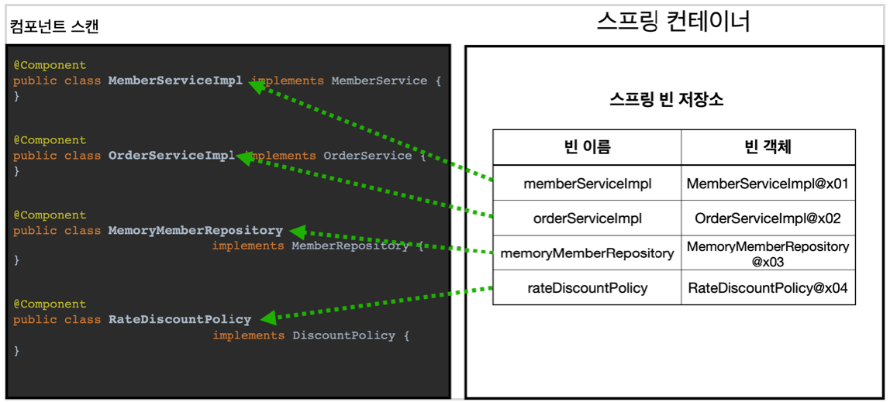
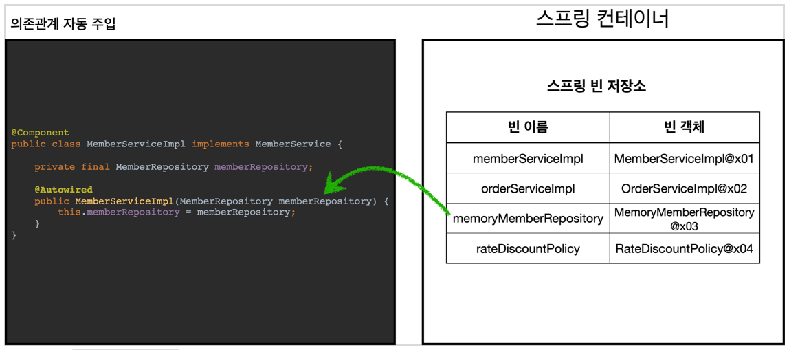

# 4. 컴포넌트 스캔

---

## 컴포넌트 스캔과 의존관계 자동 주입 시작하기

+ 이전까진 스프링 빈을 등록할 때 `@Bean`등을 통해 직접 빈을 나열했다.
+ 등록해야 할 스프링 빈이 많아지면 귀찮고, 누락하는 문제도 생긴다
+ 설정 정보가 없어도 스프링 빈을 등록하는 컴포넌트 스캔이라는 기능을 제공한다.
+ 의존관계도 자동으로 주입하는 `@Autowired` 기능도 제공한다.

AutoAppConfig

```java

@Configuration
@ComponentScan(
        excludeFilters = @ComponentScan.Filter(type = FilterType.ANNOTATION, classes = Configuration.class)
)
public class AutoAppConfig {

}
```

+ 컴포넌트 스캔을 사용하려면 `@ComponentScan`을 설정 정보에 붙여준다
    + 컴포넌트 스캔은 `@Component` 애노테이션이 붙은 클래스를 스캔해서 스프링 빈으로 등록한다.

> 컴포넌트 스캔을 사용하면 `@Configuration` 이 붙은 설정 정보도 자동으로 등록되기 때문에 AppConfig,TestConfig 등 만들어두었던 설정 정보도 함께 등록되어 실행된다. 그래서 `excludeFilters`를 사용해서 스캔 대상에서 제외한다.
>   > Configuration안에 `@Target(ElementType.TYPE)
@Retention(RetentionPolicy.RUNTIME)
@Documented @Component` 가 붙어있기 때문에 ComponentScan시 등록된다.

MemoryMemberRepository @Component 추가

```java

@Component
public class MemoryMemberRepository implements MemberRepository {
}
```

RateDiscountPolicy @Component 추가

```java

@Component
public class RateDiscountPolicy implements DiscountPolicy {
}
```

MemberServiceImpl @Component, @Autowired 추가

```java

@Component
public class MemberServiceImpl implements MemberService {

    private final MemberRepository memberRepository;

    @Autowired //ac.getBean(MemberRepository.class)
    public MemberServiceImpl(MemberRepository memberRepository) {
        this.memberRepository = memberRepository;
    }
}
```

OrderServiceImpl @Component, @Autowired 추가

```java

@Component
public class OrderServiceImpl implements OrderService {

    private final MemberRepository memberRepository;
    private final DiscountPolicy discountPolicy;

    @Autowired
    public OrderServiceImpl(MemberRepository memberRepository, DiscountPolicy discountPolicy) {
        this.memberRepository = memberRepository;
        this.discountPolicy = discountPolicy;
    }
}
```

+ 이전엔 AppConfig에서는 `@Bean`으로 직접 설정 정보를 작성했고, 의존관계도 직접 명시했다.
+ `@Autowired`는 의존관계를 자동으로 주입해준다.

**테스트**

```java
public class AutoAppConfigTest {

    @Test
    void basicScan(){
        AnnotationConfigApplicationContext ac = new AnnotationConfigApplicationContext(AutoAppConfig.class);

        MemberService memberService = ac.getBean(MemberService.class);
        Assertions.assertThat(memberService).isInstanceOf(MemberService.class);
    }
}
```



+ `@ComponentScan`은 `@Component`가 붙은 모든 클래스를 스프링 빈으로 등록한다.
+ 이 때 스프링 빈의 기본 이름은 클래스명을 사용하되 맨 앞 글자만 소문자를 사용한다.
  + **빈 이름 기본 전략** MemberServiceImpl 클래스 -> memberServiceImpl
  + **빈 이름 직접 지정** `Component("MemberService2")`로 부여 하면 된다.



+ 생성자에 `@Autowired`를 지정하면, 스프링 컨테이너가 자동으로 해당 스프링 빈을 찾아서 주입한다.
+ 이때 기본 전략은 탕비이 같은 빈을 찾아서 주입한다.
  + `getBean(MemberRepository.class)`와 동일하다고 이해하면 된다.
+ 생성자에 파라미터가 많아도 다 찾아서 자동으로 주입한다.
