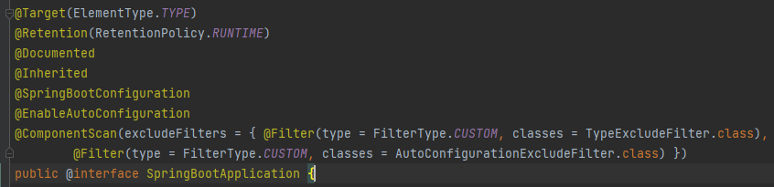

# 4. 컴포넌트 스캔

---

## 컴포넌트 스캔과 의존관계 자동 주입 시작하기

+ 이전까진 스프링 빈을 등록할 때 `@Bean`등을 통해 직접 빈을 나열했다.
+ 등록해야 할 스프링 빈이 많아지면 귀찮고, 누락하는 문제도 생긴다
+ 설정 정보가 없어도 스프링 빈을 등록하는 컴포넌트 스캔이라는 기능을 제공한다.
+ 의존관계도 자동으로 주입하는 `@Autowired` 기능도 제공한다.

AutoAppConfig

```java

@Configuration
@ComponentScan(
        excludeFilters = @ComponentScan.Filter(type = FilterType.ANNOTATION, classes = Configuration.class)
)
public class AutoAppConfig {

}
```

+ 컴포넌트 스캔을 사용하려면 `@ComponentScan`을 설정 정보에 붙여준다
    + 컴포넌트 스캔은 `@Component` 애노테이션이 붙은 클래스를 스캔해서 스프링 빈으로 등록한다.

> 컴포넌트 스캔을 사용하면 `@Configuration` 이 붙은 설정 정보도 자동으로 등록되기 때문에 AppConfig,TestConfig 등 만들어두었던 설정 정보도 함께 등록되어 실행된다. 그래서 `excludeFilters`를 사용해서 스캔 대상에서 제외한다.
>   > Configuration안에 `@Target(ElementType.TYPE)
@Retention(RetentionPolicy.RUNTIME)
@Documented @Component` 가 붙어있기 때문에 ComponentScan시 등록된다.

MemoryMemberRepository @Component 추가

```java

@Component
public class MemoryMemberRepository implements MemberRepository {
}
```

RateDiscountPolicy @Component 추가

```java

@Component
public class RateDiscountPolicy implements DiscountPolicy {
}
```

MemberServiceImpl @Component, @Autowired 추가

```java

@Component
public class MemberServiceImpl implements MemberService {

    private final MemberRepository memberRepository;

    @Autowired //ac.getBean(MemberRepository.class)
    public MemberServiceImpl(MemberRepository memberRepository) {
        this.memberRepository = memberRepository;
    }
}
```

OrderServiceImpl @Component, @Autowired 추가

```java

@Component
public class OrderServiceImpl implements OrderService {

    private final MemberRepository memberRepository;
    private final DiscountPolicy discountPolicy;

    @Autowired
    public OrderServiceImpl(MemberRepository memberRepository, DiscountPolicy discountPolicy) {
        this.memberRepository = memberRepository;
        this.discountPolicy = discountPolicy;
    }
}
```

+ 이전엔 AppConfig에서는 `@Bean`으로 직접 설정 정보를 작성했고, 의존관계도 직접 명시했다.
+ `@Autowired`는 의존관계를 자동으로 주입해준다.

**테스트**

```java
public class AutoAppConfigTest {

    @Test
    void basicScan() {
        AnnotationConfigApplicationContext ac = new AnnotationConfigApplicationContext(AutoAppConfig.class);

        MemberService memberService = ac.getBean(MemberService.class);
        Assertions.assertThat(memberService).isInstanceOf(MemberService.class);
    }
}
```


+ `@ComponentScan`은 `@Component`가 붙은 모든 클래스를 스프링 빈으로 등록한다.
+ 이 때 스프링 빈의 기본 이름은 클래스명을 사용하되 맨 앞 글자만 소문자를 사용한다.
    + **빈 이름 기본 전략** MemberServiceImpl 클래스 -> memberServiceImpl
    + **빈 이름 직접 지정** `Component("MemberService2")`로 부여 하면 된다.


+ 생성자에 `@Autowired`를 지정하면, 스프링 컨테이너가 자동으로 해당 스프링 빈을 찾아서 주입한다.
+ 이때 기본 전략은 탕비이 같은 빈을 찾아서 주입한다.
    + `getBean(MemberRepository.class)`와 동일하다고 이해하면 된다.
+ 생성자에 파라미터가 많아도 다 찾아서 자동으로 주입한다.

---

## 탐색 위치와 기본 스캔 대상

+ 컴포넌트 스캔은 `basePackages`를 사용해 탐색할 패키지의 시작 위치를 지정할 수 있다.
  + `basePackages = {"hello.core", "hello.service"}` 여러 시작 위치를 지정할 수도 있다.

```java
@Configuration
@ComponentScan(
        basePackages = "hello.core.member",
        excludeFilters = @ComponentScan.Filter(type = FilterType.ANNOTATION, classes = Configuration.class)
)
```

+ `basePackageClasses = AutoAppConfig.class` 지정한 클래스 패키지를 탐색 시작 위치로 지정한다.
+ 지정하지 않으면 `@ComponentScan`이 붙은 설정 정보 클래스의 패키지가 시작 위치가 된다.

```java
package hello.core;

import org.springframework.context.annotation.ComponentScan;
import org.springframework.context.annotation.Configuration;
import org.springframework.context.annotation.FilterType;

@Configuration
@ComponentScan(
        basePackages = "hello.core.member",
        excludeFilters = @ComponentScan.Filter(type = FilterType.ANNOTATION,classes = Configuration.class)
)
public class AutoAppConfig {

}
```

`@ComponentScan`이 붙은 hello.core package가 탐색 시작 위치가 된다.

### 권장하는 방법

패키지 위치를 지정하지 않고, 설정 정보 클래스의 위치를 프로젝트 최상단에 두는 것

스프링 부트를 사용하면 `@SpringBootApplication`를 프로젝트 시작 루트 위치에 두는 것이 관례이다.



+ 그림과 같이 `@ComponentScan`이 붙어있다.
  + 스프링 부트를 사용하면 `@ComponentScan`을 따로 사용하지 않아도 된다.

### 컴포넌트 스캔 기본 대상

+ 컴포넌트 스캔은 `Component`뿐만 아니라 다음과 같은 애노테이션도 대상에 포함한다.
  + `@Component`: 컴포넌트 스캔애서 사용
  + `@Controller`: 스프링 MVC 컨트롤러에서 사용
  + `@Service` : 스프링 비즈니스 로직에서 사용
  + `@Repository` : 스프링 데이터 접근 계층에서 사용
  + `@Configuration` : 스프링 설정 정보에서 사용
    + `@Component`가 다 붙어있다.

컴포넌트 스캔의 용도 뿐만 아니라 다음과 같은 부가 기능도 수행한다.

+ `@Controller` : 스프링 MVC 컨트롤러로 인식
+ `@Repository` : 스프링 데이터 접근 계층으로 인식하고, 데이터 계층의 예외를 스프링 예외로 변환해준다.
+ `@Configuration` : 설정정보로 인식하고, 스프링 빈이 싱글톤을 유지하도록 추가 처리
+ `@Service` : 특별한 처리는 없고 비즈니스 로직이 있다고 계층을 인식하는데 도움

---

## 필터

+ `includeFilters`: 컴포넌트 스캔 대상을 추가로 지정한다.
+ `excludeFilters` : 컴포넌트 스캔에서 제외할 대상을 지정한다.

---

BeanA

```java
@MyIncludeComponent
public class BeanA {
}

```

BeanB

```java
@MyIncludeComponent
public class BeanB {
}

```


```java
public class ComponentFilterAppConfigTest {

    @Test
    void filterScan() {
        ApplicationContext ac = new AnnotationConfigApplicationContext(ComponentFilterAppConfig.class);
        BeanA beanA = ac.getBean("beanA", BeanA.class);
        Assertions.assertThat(beanA).isNotNull();

        org.junit.jupiter.api.Assertions.assertThrows(
                NoSuchBeanDefinitionException.class,
                () -> ac.getBean("beanB", BeanB.class)
        );


    }

    @Configuration
    @ComponentScan(
            includeFilters = @Filter(type = FilterType.ANNOTATION, classes = MyIncludeComponent.class),
            excludeFilters = @Filter(type = FilterType.ANNOTATION, classes = MyExcludeComponent.class)
    )
    static class ComponentFilterAppConfig {

    }
}
```

BeanB는 스프링 빈에 등록되지 않는다.

---

## 중복 등록과 충돌

1. 자동 빈 등록 Vs 자동 빈 등록
2. 수동 빈 등록 Vs 자동 빈 등록

---

### 자동 빈 등록 Vs 자동 빈 등록

+ 컴포넌트 스캔에 의해 자동으로 스프링 빈이 등록되는데, 그 이름이 같은 경우 오류를 발생시킨다.
  + `ConflictingBeanDefinitionException` 예외 발생

```java
@Component("service")
public class OrderServiceImpl implements OrderService{}

@Component("service")
public class MemberServiceImpl implements MemberService{}
```

AutoAppConfig를 돌리면 충돌이 발생한다
`Caused by: org.springframework.context.annotation.ConflictingBeanDefinitionException: Annotation-specified bean name 'service' for bean class [hello.core.order.OrderServiceImpl] conflicts with existing, non-compatible bean definition of same name and class [hello.core.member.MemberServiceImpl]
`

자동 빈 등록 끼리의 충돌은 거의 없다.

### 수동 빈 등록 Vs 자동 빈 등록

```java
@Component
public class MemoryMemberRepository implements MemberRepository{}
```

AutoAppConfig에 Bean 등록
```java
@Configuration
@ComponentScan(
        excludeFilters = @ComponentScan.Filter(type = FilterType.ANNOTATION,classes = Configuration.class)
)
public class AutoAppConfig {

    @Bean(name = "memoryMemberRepository")
    MemberRepository memberRepository(){
        return new MemoryMemberRepository();
    }
}
```

이 경우 수동 빈 등록이 우선권을 가진다.(수동 빈이 자동 빈을 오버라이딩 해버림)

`Overriding bean definition for bean 'memoryMemberRepository' with a different definition: replacing`

최근 스프링 부트에서는 수동 빈 등록과 자동 빈 등록이 충돌나면 오류가 발생하도록 기본값을 바꾸었다.

`Consider renaming one of the beans or enabling overriding by setting spring.main.allow-bean-definition-overriding=true` 를 설정하면 오버라이딩 할 수 있다.

