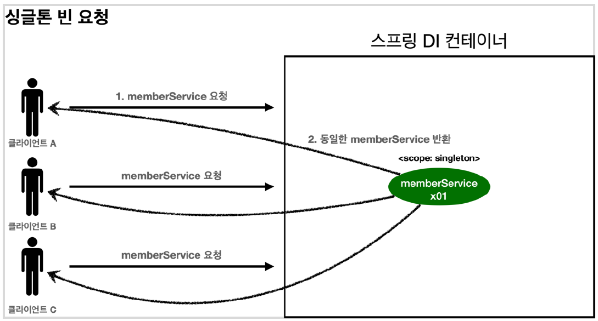
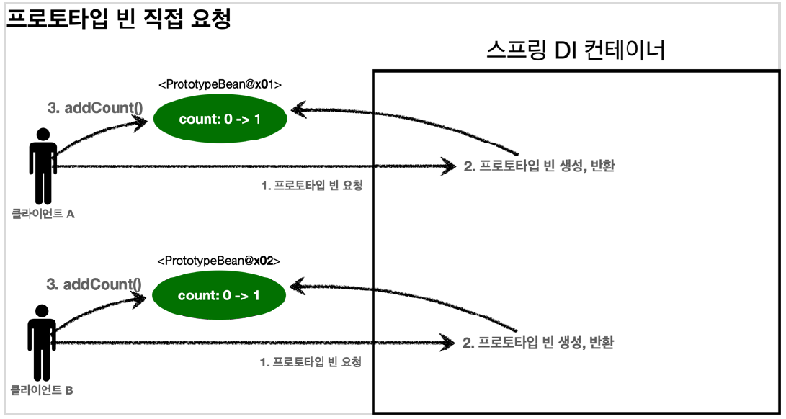

# 빈 스코프

---

## 빈 스코프란?

지금까지 스프링 빈이 스프링 컨테이너의 시작과 함께 생성되어서 컨테이너가 종료될 때 까지 유지된다고 학습했다.

기본적으로 스프링 빈이 **싱글톤 스코프**로 생성되기 때문이다.

**스프링은 다음과 같은 다양한 스코프를 지원한다.**

+ **싱글톤**: 기본 스코프, 스프링 컨테이너의 시작과 종료까지 유지되는 가장 넓은 범위의 스코프
+ **프로토타입**: 스프링 컨테이너는 프로토타입 빈의 생성과 의존관계 주입까지 관여하고 더는 관리하지 않는 매우 짧은 범위의 스코프
+ **웹 관련 스코프**
  + **request**: 웹 요청이 들어오고 나갈 때 까지 유지되는 스코프
  + **session**: 웹 세션이 생성되고 종료될 때 까지 유지되는 스코프
  + **application**: 웹의 서블릿 컨텍스트와 같은 범위로 유지되는 스코프


---

## 프로토타입 스코프

싱글톤 스코프의 빈을 조회하면 스프링 컨테이너는 항상 같은 인스턴스의 스프링 빈을 반환한다. 반면에 프로토타입 스코프를 조회하면 스프링 컨테이너는 항상 새로운 인스턴스를 생성해서 반환한다.

---



1. 싱글톤 스코프의 빈을 스프링 컨테이너에 요청한다.
2. 스프링 컨테이너는 본인이 관리하는 스프링 빈을 반환한다.
3. 이후에 같은 요청이 와도 **같은 객체 인스턴스의 스프링 빈**을 반환한다.


1. 프로토타입 스코프의 빈을 스프링 컨테이너에 요청한다.
2. 스프링 컨테이너는 **이 시점**에 프로토타입 빈을 생성하고, 필요한 의존관계를 주입한다.


3. 스프링 컨테이너는 생성한 프로토타입 빈을 클라이언트에 반환한다.
4. 이후에 스프링 컨테이너에 같은 요청이 오면 **항상 새로운 프로토 타입 빈을 생성해서 반환**한다.


### 정리
스프링 컨테이너는 프로토타입 빈을 생성하고, 의존관계 주입, 초기화까지만 처리 한다.

프로토타입 빈을 관리할 책임은 프로토타입 빈을 받은 클라이언트에 있다. `@PreDestroy`같은 종료 메서드가 호출되지 않는다.


**싱글톤 스코프 빈 테스트**

```java
public class SingletonTest {

  @Test
  void singletonBeanFind(){
    AnnotationConfigApplicationContext ac = new AnnotationConfigApplicationContext(SingletonBean.class);

    SingletonBean singletonBean1 = ac.getBean(SingletonBean.class);
    SingletonBean singletonBean2 = ac.getBean(SingletonBean.class);

    System.out.println("singletonBean1 = " + singletonBean1);
    System.out.println("singletonBean2 = " + singletonBean2);

    assertThat(singletonBean1).isSameAs(singletonBean2);

    ac.close();
  }

  @Scope("singleton")
  static class SingletonBean{

    @PostConstruct
    public void init(){
      System.out.println("Singleton.init");
    }

    @PreDestroy
    public void destroy(){
      System.out.println("singleton.destroy");
    }
  }
}
```

`AnnotationConfigApplicationContext ac = new AnnotationConfigApplicationContext(SingletonBean.class);`

+ `SingletonBean.class`를 넣어주면 `@Component`가 없어도 클래스가 `ComponentScan`의 대상이 되기 때문에 빈으로 등록된다.


```text
Singleton.init
singletonBean1 = hello.core.scope.SingletonTest$SingletonBean@61861a29
singletonBean2 = hello.core.scope.SingletonTest$SingletonBean@61861a29
15:47:30.696 [Test worker] DEBUG org.springframework.context.annotation.AnnotationConfigApplicationContext - Closing org.springframework.context.annotation.AnnotationConfigApplicationContext@67304a40, started on Fri Mar 04 15:47:30 KST 2022
singleton.destroy
```

+ 같은 인스턴스의 빈을 조회한다.
+ 종료 메서드까지 정상 호출 됨

**프로토타입 스코프 빈 테스트**

```java
public class PrototypeTest {

    @Test
    void prototypeBeanFind(){
        AnnotationConfigApplicationContext ac = new AnnotationConfigApplicationContext(PrototypeBean.class);

        System.out.println("find prototypeBean1");
        PrototypeBean prototypeBean1 = ac.getBean(PrototypeBean.class);
        System.out.println("find prototypeBean2");
        PrototypeBean prototypeBean2 = ac.getBean(PrototypeBean.class);

        System.out.println("prototypeBean1 = " + prototypeBean1);
        System.out.println("prototypeBean2 = " + prototypeBean2);

        Assertions.assertThat(prototypeBean1).isNotSameAs(prototypeBean2);

        ac.close();
    }

    @Scope("prototype")
    static class PrototypeBean{
        @PostConstruct
        public void init(){
            System.out.println("PrototypeBean.init");
        }

        @PreDestroy
        public void destroy(){
            System.out.println("PrototypeBean.destroy");
        }
    }
}
```

```text
find prototypeBean1
PrototypeBean.init
find prototypeBean2
PrototypeBean.init
prototypeBean1 = hello.core.scope.PrototypeTest$PrototypeBean@61861a29
prototypeBean2 = hello.core.scope.PrototypeTest$PrototypeBean@31024624
```

+ 프로토 타입 스코프의 빈은 스프링 컨테이너에서 빈을 조회할 때 생성되고, 초기화 메서드도 실행된다.
+ 2번 조회 했으므로 초기화도 2번 실행
+ 초기화 까지만 관여하고 더는 관리하지 않는다. 따라서 프로토 타입 빈은 스프링 컨테이너가 종료될 때 `@PreDestroy`같은 종료 메서드가 실행되지 않는다.

### 프로토 타입 빈의 특징 정리

+ 스프링 컨테이너에 요청할 때 마다 새로 생성된다.
+ 스프링 컨테이너는 프로토타입 빈의 생성과 의존관계 주입 그리고 초기화까지만 관여한다.
+ 종료 메서드가 호출되지 않는다.
+ 프로토 타입의 빈은 빈을 조회한 클라이언트가 관리해야 한다. 종료 메서드가 필요하면 클라이언트가 직접 해야한다.

---

## 프로토타입 스코프 - 싱글톤 빈과 함께 사용시 문제점

스프링 컨테이너에 프로토타입 스코프의 빈을 요청하면 항상 새로운 객체 인스턴스를 생성해서 반환한다.

하지만 싱글톤 빈과 함께 사용할 때는 의도한 대로 잘 동작하지 않는다.

---


1. 클라이언트A는 스프링 컨테이너에 프로토타입 빈을 요청한다.
2. 컨테이너는 프로토타입 빈을 생성해서 반환(x01)한다. 해당 빈의 count 필드 값은 0이다.
3. 클라이언트는 조회한 프로토타입 빈에 addCount()를 호출하면서 count 필드를 +1 한다.
4. 결과적으로 프로토타입 빈(x01)의 count는 1이 된다.




1. 클라이언트B는 스프링 컨테이너에 프로토타입 빈을 요청한다.
2. 스프링 컨테이너는 프로토타입 빈을 새로 생성해서 반환(x02)한다. 해당 빈의 count 필드 값은 0이다.
3. 클라이언트는 조회한 프로토타입 빈에 addCount()를 호출하면서 count 필드를 +1 한다.
4. 결과적으로 프로토타입 빈(x02)의 count는 1이 된다.

```java
public class SingletonWithPrototypeTest1 {

    @Test
    void prototypeFind(){
        AnnotationConfigApplicationContext ac = new AnnotationConfigApplicationContext(PrototypeBean.class);
        PrototypeBean prototypeBean1 = ac.getBean(PrototypeBean.class);
        prototypeBean1.addCount();

        assertThat(prototypeBean1.getCount()).isEqualTo(1);
        PrototypeBean prototypeBean2 = ac.getBean(PrototypeBean.class);
        prototypeBean2.addCount();
        assertThat(prototypeBean1.getCount()).isEqualTo(1);

    }

    @Scope("prototype")
    static class PrototypeBean{
        private int count = 0;

        public void addCount(){
            count++;
        }

        public int getCount(){
            return count;
        }

        @PostConstruct
        public void init(){
            System.out.println("PrototypeBean.init " + this);
        }

        @PreDestroy
        public void destroy(){
            System.out.println("PrototypeBean.destroy");
        }
    }
}
```
테스트가 잘 통과한다.


### 싱글톤 빈에서 프로토타입 빈 사용

`clientBean`이라는 싱글톤 빈이 의존관계 주입을 통해서 프로토타입 빈을 주입 받아서 사용하는 예를 보자


+ `clientBean`은 싱글톤이므로, 컨테이너 생성 시점에 함께 생성되고, 의존관계 주입도 발생한다.
1. `clientBean`은 의존관계 자동 주입을 사용한다. 주입 시점에 스프링 컨테이너에 프로토타입 빈을 요청한다.
2. 스프링 컨테이너는 프로토타입 빈을 생성해서 `clientBean`에 반환한다.
+ 이제 `clientBean`은 프로토타입 빈을 내부 필드에 보관한다.


+ 클라이언트A는 `clientBean`을 스프링 컨테이너에 요청해서 받는다. 싱글톤이므로 항상 같은 `clientBean`이 반환된다.
3. 클라이언트 A는 `clientBean.logic()`을 호출한다.
4. `clientBean`은 prototypeBean의 `addCount()`를 호출해서 프로토타입 빈의 count를 증가시킨다.


+ 클라이언트B는 `clientBean`을 스프링 컨테이너에 요청해서 받는다. 
+ **clientBean이 내부에 가지고 있는 프로토타입 빈은 이미 과거에 주입이 끝난 빈이다.** 주입 시점에 스프링 컨테이너에 요청해서 프로토타입 빈이 생성된 것이지, 사용 할 때마다 새로 생성되는 것이 아니다!
5. 클라이언트B는 `clientBean.logic()`을 호출한다.
6. `clientBean`은 prototypeBean의 `addCount()`를 호출해서 프로토타입 빈의 count를 증가시킨다. count값이 2가 된다.

```java
public class SingletonWithPrototypeTest1 {

    @Test
    void prototypeFind(){
        AnnotationConfigApplicationContext ac = new AnnotationConfigApplicationContext(PrototypeBean.class);
        PrototypeBean prototypeBean1 = ac.getBean(PrototypeBean.class);
        prototypeBean1.addCount();

        assertThat(prototypeBean1.getCount()).isEqualTo(1);
        PrototypeBean prototypeBean2 = ac.getBean(PrototypeBean.class);
        prototypeBean2.addCount();
        assertThat(prototypeBean1.getCount()).isEqualTo(1);

    }

    @Test
    void singletonClientUsePrototype(){
        AnnotationConfigApplicationContext ac = new AnnotationConfigApplicationContext(ClientBean.class,PrototypeBean.class);
        ClientBean clientBean1 = ac.getBean(ClientBean.class);
        int count1 = clientBean1.logic();
        assertThat(count1).isEqualTo(1);

        ClientBean clientBean2 = ac.getBean(ClientBean.class);
        int count2 = clientBean2.logic();
        assertThat(count2).isEqualTo(2);

    }

    @Scope("singleton")
    static class ClientBean{
        private final PrototypeBean prototypeBean;

        @Autowired
        public ClientBean(PrototypeBean prototypeBean) {
            this.prototypeBean = prototypeBean;
        }

        public int logic(){
            prototypeBean.addCount();
            return prototypeBean.getCount();
        }
    }

    @Scope("prototype")
    static class PrototypeBean{
        private int count = 0;

        public void addCount(){
            count++;
        }

        public int getCount(){
            return count;
        }

        @PostConstruct
        public void init(){
            System.out.println("PrototypeBean.init " + this);
        }

        @PreDestroy
        public void destroy(){
            System.out.println("PrototypeBean.destroy");
        }
    }
}
```

싱글톤 빈은 생성시점에만 의존관계를 주입받기 때문에 프로토타입 빈이 새로 주입되지 않는다.

---

## 프로토타입 스코프 - 싱글톤 빈과 함께 사용시 Provider로 문제 해결

싱글톤 빈과 프로토타입 빈을 함께 사용할 때, 어떻게 하면 사용할 때 마다 항상 새로운 프로토타입 빈을 생성할 수 있을까?

---

가장 간단한 방법은 싱글톤 빈이 프로토타입을 사용할 때 마다 스프링 컨테이너에 새로 요청하는 것이다.

```java
public class PrototypeProviderTest {

    @Test
    void providerTest(){
        AnnotationConfigApplicationContext ac = new AnnotationConfigApplicationContext(ClientBean.class, PrototypeBean.class);

        ClientBean clientBean1 = ac.getBean(ClientBean.class);
        int count1 = clientBean1.logic();
        assertThat(count1).isEqualTo(1);

        ClientBean clientBean2 = ac.getBean(ClientBean.class);
        int count2 = clientBean2.logic();
        assertThat(count2).isEqualTo(1);
        
    }


    static class ClientBean {
        @Autowired
        private ApplicationContext ac;

        public int logic() {
            PrototypeBean prototypeBean = ac.getBean(PrototypeBean.class);
            prototypeBean.addCount();
            int count = prototypeBean.getCount();
            return count;
        }
    }

    @Scope("prototype")
    static class PrototypeBean {
        private int count = 0;

        public void addCount() {
            count++;
        }

        public int getCount() {
            return count;
        }

        @PostConstruct
        public void init() {
            System.out.println("PrototypeBean.init " + this);
        }

        @PreDestroy
        public void destroy() {
            System.out.println("PrototypeBean.destroy");
        }
    }
}
```

+ `ac.getBean()`을 통해서 항상 새로운 프로토타입 빈이 생성되는 것을 확인할 수 있다.
```java
 static class ClientBean {
        @Autowired
        private ApplicationContext ac;

        public int logic() {
            PrototypeBean prototypeBean = ac.getBean(PrototypeBean.class);
            prototypeBean.addCount();
            int count = prototypeBean.getCount();
            return count;
        }
    }
```
+ 의존관계를 외부에서 주입(DI)받는게 아니라 직접 필요한 의존관계를 찾는 것을 **Dependency Lookup(DL) 의존관계 조회(탐색)** 이라 한다.
+ 그러나 스프링의 애플리케이션 컨텍스트 전체를 주입받게 되면, 스프링 컨테이너에 종속적인 코드가 되고, 단위 테스트도 어려워진다.
+ 지금 필요한 기능은 지정한 프로토타입 빈을 컨테이너에서 대신 찾아주는 **DL** 정도의 기능만 제공하는 무언가가 있으면 된다.


ObjectFactory, ObjectProvider

지정한 빈을 컨테이너에서 대신 찾아주는 DL 서비스를 제공하는 것이 바로 `ObjectProvider`이다.

```java
    @Scope("singleton")
    static class ClientBean{
        @Autowired private ObjectProvider<PrototypeBean> prototypeBeanProvider;

        public int logic(){
            PrototypeBean prototypeBean = prototypeBeanProvider.getObject();
            prototypeBean.addCount();
            return prototypeBean.getCount();
        }
    }
```

+ `prototypeBeanProvider.getObject()`를 통해 항상 새로운 프로토타입 빈이 생성되는 것을 확인할 수 있다.
+ `ObjectProvider`의 `getObject()`를 호출하면 내부에서는 스프링 컨테이너를 통해 해당 빈을 찾아서 반환한다.**(DL)**
+ 스프링이 제공하는 기능을 사용하지만, 기능이 단순하므로 단위테스트를 만들거나 mock 코드를 만들기는 훨씬 쉬워진다.
+ `ObjectProvider`는 지금 딱 필요한 DL 정도의 기능만 제공한다.

> 참고
> `ObjectFactory`: 기능이 단순, 별도의 라이브러리 없음, 스프링에 의존
> 
> `ObjectProvider`: `ObjectFactory`상속, 옵션, 스트림 처리등 편의 기능이 많고, 별도의 라이브러리가 필요 없음, 스프링에 의존


### JSR-330 Provider

JSR-330 Provider는 JSR-330 자바 표준을 사용한 Provider이다.
사용하려면 gradle에 `javax.inject:javax.inject:1`을 추가해주어야 한다.

```java
    @Scope("singleton")
    static class ClientBean{
        @Autowired private Provider<PrototypeBean> prototypeBeanProvider;

        public int logic(){
            PrototypeBean prototypeBean = prototypeBeanProvider.get();
            prototypeBean.addCount();
            return prototypeBean.getCount();
        }
    }
```

+ `Provider.get()`을 통해서 항상 새로운 프로토타입 빈을 생성한다.
+ `Provider`의 `get()`을 호출하면 내부에서 스프링 컨테이너를 통해 해당 빈을 찾아서 반환한다.(**DL**)
+ `get()`메서드 하나로 기능이 매우 단순하다.


### 정리

+ 프로토타입 빈은 언제 사용할까? 
  + 매번 사용할 때 마다 의존관계 주입이 완료된 새로운 객체가 필요하면 사용하면 된다.
  + 실무에선 싱글톤 빈으로 대부분의 문제를 해결할 수 있기 때문에 프로토타입 빈을 직접적으로 사용하는 일은 매우 드물다.
+ `ObjectProvider`, `JSR-330 Provider`등은 프로토타입 뿐만 아니라 DL이 필요한 경우는 언제든지 사용할 수 있다.

---

## 웹 스코프

---

### 웹 스코프의 특징

+ 웹 스코프는 웹 환경에서만 동작한다.
+ 웹 스코프는 스프링이 해당 스코프의 종료 시점까지 관리한다. -> 종료 메서드가 호출된다.


### 웹 스코프의 종류

+ **request**: HTTP 요청 하나가 들어오고 나갈 때 까지 유지되는 스코프, 각각의 HTTP 요청마다 별도의 빈 인스턴스가 생성되고, 관리된다.
+ **session**: HTTP Session과 동일한 생명주기를 가진다.
+ **application**: 서블릿 컨텍스트(`ServletContext`)와 동일한 생명주기를 가진다.
+ **websocket**: 웹 소켓과 동일한 생명주기를 가진다.


A와 B가 동시에 요청해도 각각 다른 scope가 사용된다.

---

## request 스코프 예제 만들기

웹 스코프는 웹 환경에서만 동작하므로 web 환경이 동작하도록 라이브러리를 추가 한다.

build.gradle

```java
implementation 'org.springframework.boot:spring-boot-starter-web'
```

### request 스코프 예제 개발

동시에 여러 HTTP 요청이 오면 정확히 어떤 요청이 남긴 로그인지 구분하기 어렵다.

이럴때 사용하기 좋은것이 request 스코프이다.

+ 기대하는 공동 포맷: `[UUID][requestURL]{message}`
+ UUID를 사용해서 HTTP 요청을 구분한다.


```java
@Component
@Scope(value = "request")
public class MyLogger {

    private String uuid;
    private String requestURL;

    public void setRequestURL(String requestURL){
        this.requestURL = requestURL;
    }

    public void log(String message){
        System.out.println("[" + uuid + "]" + "[" + requestURL + "] " + message);
    }

    @PostConstruct
    public void init(){
        uuid = UUID.randomUUID().toString();
        System.out.println("[" + uuid + "] request scope bean create:" + this);
    }

    @PreDestroy
    public void close(){
        System.out.println("[" + uuid + "] request scope bean close:" + this);
    }
}
```

+ 로그를 출력하기 위한 `MyLogger` 클래스
+ `@Scope(value = "request")`를 사용해서 request 스코프로 지정.
  + 이 빈은 HTTP 요청 당 하나씩 생성되고, HTTP 요청이 끝나는 시점에 소멸된다.
+ `requestURL`은 빈이 생성되는 시점에 알 수 없으므로, 외부에서 setter로 입력 받는다.


web/LogDemoController

```java
@Controller
@RequiredArgsConstructor
public class LogDemoController {

    private final LogDemoService logDemoService;
    private final MyLogger myLogger;

    @RequestMapping("log-demo")
    @ResponseBody
    public String logDemo(HttpServletRequest request){
        String requestURL = request.getRequestURL().toString();
        myLogger.setRequestURL(requestURL);

        myLogger.log("controller test");
        logDemoService.logic("testId");
        return "OK";
    }
}
```

+ 로거가 잘 동작하는지 확인하는 테스트용 컨트롤러
+ HttpServletRequest를 통해 요청 URL을 받는다.
+ MyLogger는 HTTP 요청마다 구분되므로 다른 HTTP 요청 때문에 값이 섞이는 걱정을 하지 않아도 된다.

web/LogDemoService

```java
@Service
@RequiredArgsConstructor
public class LogDemoService {

    private final MyLogger myLogger;

    public void logic(String id) {
        myLogger.log("service id = " + id);
    }
}
```

+ 비즈니스 로직이 있는 서비스 계층


스프링 애플리케이션을 실행하면 오류가 발생한다.

+ request 스코프 빈은 요청이 오지 않아서 생성이 되지 않기 떄문에 의존관계 주입시 request 스코프를 찾지 못해서 에러가 발생한다.

Provider를 사용해서 해결할 수 있다.


---

## 스코프와 Provider

---
 
ObjectProvider 사용


web/LogDemoController

```java
@Controller
@RequiredArgsConstructor
public class LogDemoController {

  private final LogDemoService logDemoService;
  private final ObjectProvider<MyLogger> myLoggerProvider;

  @RequestMapping("log-demo")
  @ResponseBody
  public String logDemo(HttpServletRequest request){
    String requestURL = request.getRequestURL().toString();
    MyLogger myLogger = myLoggerProvider.getObject();
    myLogger.setRequestURL(requestURL);

    myLogger.log("controller test");
    logDemoService.logic("testId");
    return "OK";
  }
}
```

web/LogDemoService

```java
@Service
@RequiredArgsConstructor
public class LogDemoService {

    private final ObjectProvider<MyLogger> myLoggerProvider;

    public void logic(String id) {
        MyLogger myLogger = myLoggerProvider.getObject();
        myLogger.log("service id = " + id);
    }
}
```

+ ObjectProvider 를 사용해서 `ObjectProvider.getObject()`를 호출하는 시점까지 request scope 빈의 생성을 지연할 수 있다.


---

## 스코프와 프록시

`ObjectProvider`의 `getObject()`도 귀찮고 코드를 줄이기 위한 방법

---

```java
@Component
@Scope(value = "request", proxyMode = ScopedProxyMode.TARGET_CLASS)
public class MyLogger {}
```

+ `@Scope(value = "request", proxyMode = ScopedProxyMode.TARGET_CLASS)` 를 추가한다.
  + 적용 대상이 클래스이면 `TARGET_CLASS`
  + 인터페이스면 `INTERFACES`
+ MyLogger의 가짜 프록시 클래스를 만들어두고 HTTP request와 상관 없이 가짜 프록시 클래스를 다른 빈에 미리 주입해 둘 수 있다.

다른 클래스의 코드들은 오류가 났던 상태의 코드로 돌려놓는다.

```text
[5024127e-b792-4752-8162-6dc8b3a5f41b] request scope bean create:hello.core.common.MyLogger@633da060
[5024127e-b792-4752-8162-6dc8b3a5f41b][http://localhost:8080/log-demo] controller test
[5024127e-b792-4752-8162-6dc8b3a5f41b][http://localhost:8080/log-demo] service id = testId
[5024127e-b792-4752-8162-6dc8b3a5f41b] request scope bean close:hello.core.common.MyLogger@633da060
```

주입된 myLogger를 ` System.out.println("myLogger = " + myLogger.getClass());`로 출력해 보면 다음과 같다.

`myLogger = class hello.core.common.MyLogger$$EnhancerBySpringCGLIB$$f599f003`

CGLIB라는 라이브러리로 상속 받은 가짜 프록시 객체를 만들어서 주입한다.

+ `@Scope(value = "request", proxyMode = ScopedProxyMode.TARGET_CLASS)` 로 설정하면 스프링 컨테이너는 CGLIB라는 바이트코드를 조작하는 라이브러리를 사용해서 MyLogger를 상속받은 가짜 프록시 객체를 생성한다.
+ 생성한 객체를 스프링 컨테이너에 "myLogger"라는 이름으로 등록한다.
+ 결국 의존관계 주입도 가짜 프록시 객체가 주입된다.

**가짜 프록시 객체는 요청이 오면 그때 내부에서 진짜 빈을 요청하는 위임 로직이 들어있다.**

+ 클라이언트가 `myLogger.logic()`을 호출하면 사실은 가짜 프록시 객체의 메서드를 호출한 것이다.
+ 가짜 프록시 객체는 request scope의 진짜 `myLogger.logic()`을 호출한다.

**동작 정리**

+ CGLIB 라이브러리로 내 클래스를 상속 받은 가짜 프록시 객체를 만들어 주입한다.
+ 가짜 프록시 객체는 실제 요청이 오면 그때 내부에서 실제 빈을 요청하는 위임 로직이 들어있다.
+ 가짜 프록시 객체는 실제 request scope와는 관계가 없다. 단순히 가짜이고, 내부에 위임 로직만 있는 싱글톤 빈처럼 동작한다.


**특징 정리**

+ 프록시 객체 덕분에 클라이언트는 마치 싱글톤 빈을 사용하듯이 편리하게 request scope를 사용할 수 있다.
+ Provider나 프록시의 핵심 아이디어는 진짜 객체 조회를 꼭 필요한 시점까지 지연해준다는 점이다.
+ 단지 애노테이션 설정 변경만으로 원본 객체를 프록시 객체로 대체할 수 있다. **다형성과 DI 컨테이너의 강점!**
+ 웹 스코프가 아니더라도 프록시는 사용할 수 있다.

**주의점**

+ 싱글톤을 사용하는 것 같지만 다르게 동작하기 때문에 주의해서 사용해야 한다.
+ 꼭 필요한 곳에만 최소화해서 사용하자. 무분별하게 사용하면 유지보수하기 어려워진다.

